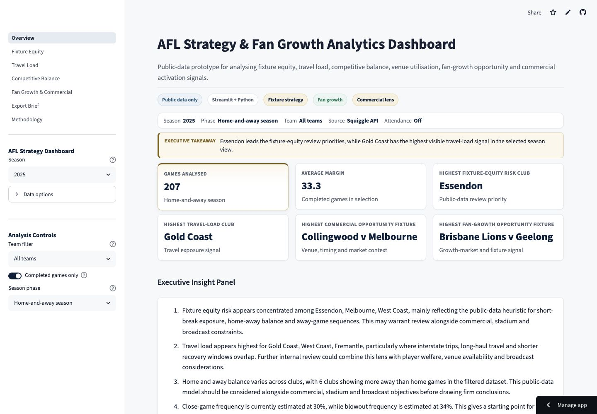
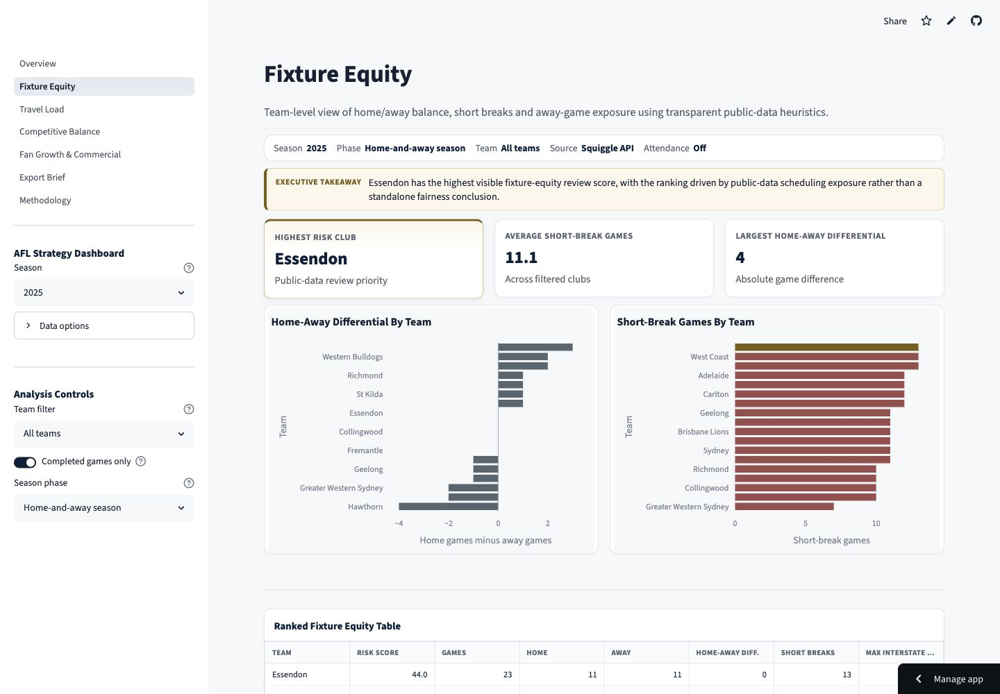
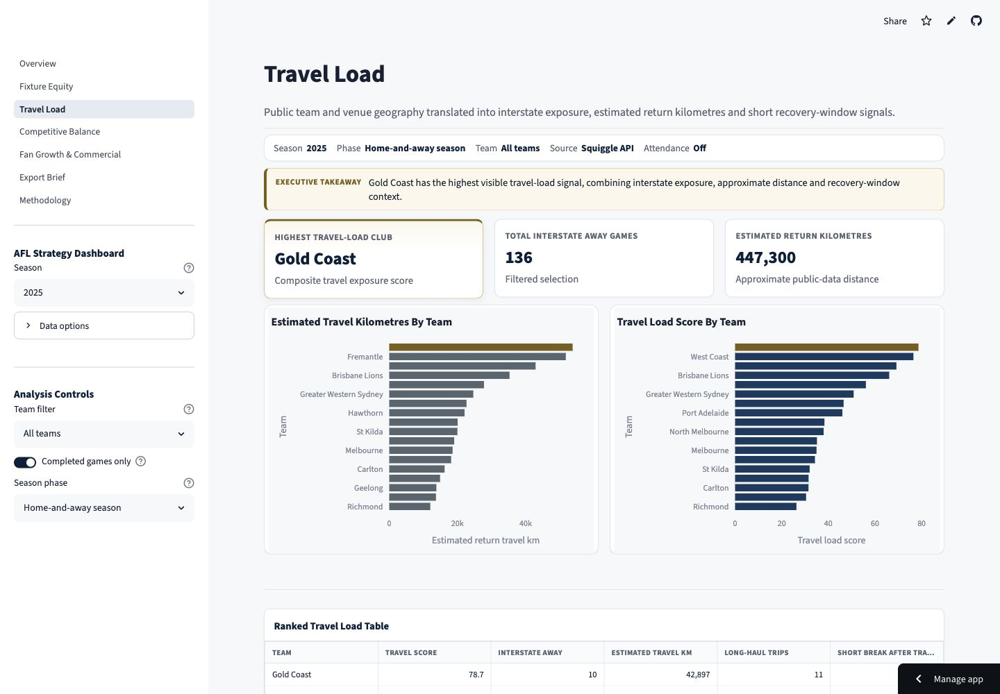
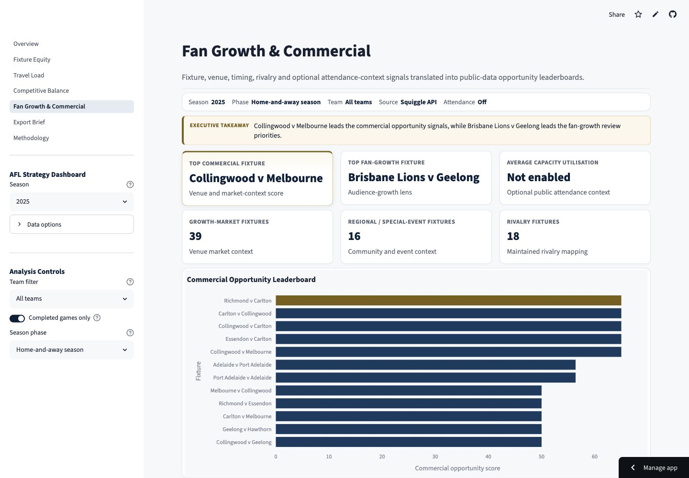
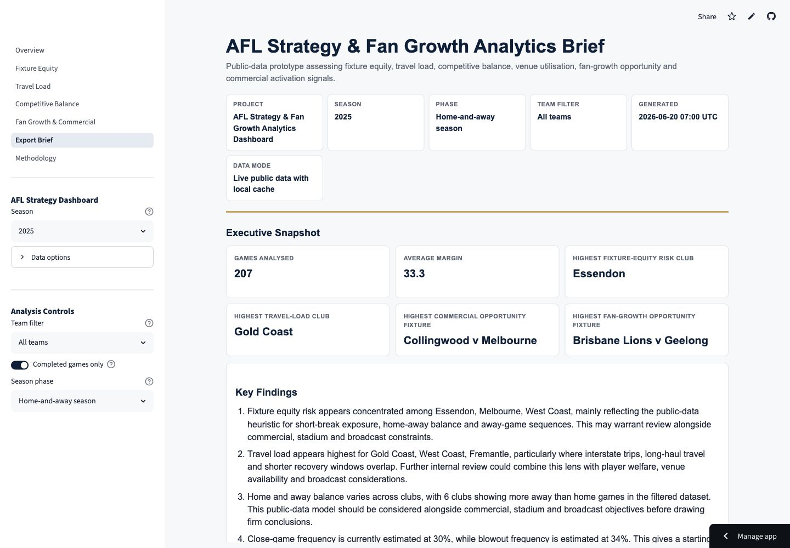

# AFL Strategy & Fan Growth Analytics Dashboard

A recruiter-ready public-data analytics prototype for exploring AFL fixture equity, travel load, competitive balance, venue utilisation, fan-growth opportunity and commercial activation signals. The project combines modular Python feature engineering, a polished multipage Streamlit interface, Plotly visualisations and executive HTML/Markdown report export.

Python | Streamlit | Plotly | Public Data Only | Tests Passing | Executive Report Export



## Why I Built This

I built this project to demonstrate AFL business thinking beyond a standard sports dashboard. AFL fixture and season planning requires trade-offs across sporting fairness, travel burden, venue operations, broadcast appeal, commercial value, fan growth and responsible communication of uncertainty.

The dashboard shows how public data can be shaped into a transparent strategy prototype for senior audiences. It does not claim to reproduce internal AFL models. It is designed to show analytical judgement, product thinking and technical execution for an AFL Graduate Program application.

## What The Dashboard Does

| Section | Purpose |
| --- | --- |
| Overview | Recruiter-facing landing view with headline KPIs, recommendations and compact leaderboards. |
| Fixture Equity | Reviews public-data signals for home/away balance, short breaks and away-game exposure. |
| Travel Load | Estimates interstate exposure, approximate return kilometres and travel-load review priorities. |
| Competitive Balance | Summarises score-derived margin profile, close games and blowouts. |
| Fan Growth & Commercial | Ranks fixtures by fan-growth and commercial opportunity using fixture, venue, timing and optional attendance-context signals. |
| Export Brief | Generates standalone HTML and Markdown executive strategy briefs from current dashboard filters. |
| Methodology | Documents data sources, scoring logic, caveats and responsible-use limitations. |

## Key Business Questions

- Which clubs show elevated public-data fixture-equity exposure?
- Where is travel load most concentrated across the selected fixture set?
- Which fixtures combine rivalry, timing, venue and competition signals?
- Where might fan-growth or commercial opportunities warrant deeper review?
- How should public-data limitations be communicated to decision-makers?
- How can an analyst turn exploratory outputs into a concise executive brief?

## Live Demo

[Open the live AFL Strategy & Fan Growth Analytics Dashboard](https://afl-strategy-dashboard.streamlit.app/)

The public deployment defaults to the completed 2025 season so recruiters see a
stable, fully populated analysis. Live Squiggle data and labelled synthetic sample
data remain available through the sidebar controls.

Run locally:

```bash
python3 -m pip install -e ".[dev]"
streamlit run src/afl_strategy_dashboard/app.py
```

Use sample-data mode for a consistent offline demo.

## Deployment

The app is ready for Streamlit Community Cloud deployment from GitHub.

```bash
streamlit run src/afl_strategy_dashboard/app.py
```

- App entrypoint: `src/afl_strategy_dashboard/app.py`
- Runtime dependencies: `requirements.txt`
- Python: 3.10 or newer
- Data policy: public data only
- Optional API identification: set `AFL_DASHBOARD_USER_AGENT`

See [Deployment Guide](docs/deployment.md) for the cloud checklist.

## Example Strategy Brief

The repository includes a generated sample brief created from synthetic/demo data:

- [Sample HTML strategy brief](docs/assets/reports/sample_strategy_brief.html)
- [Sample Markdown strategy brief](docs/assets/reports/sample_strategy_brief.md)

The sample report is generated from demo fixture data and synthetic sample attendance context. It does not contain official AFL attendance, ticketing, commercial, broadcast, private club or Champion Data sources.

Regenerate the sample brief:

```bash
python3 scripts/generate_sample_brief.py
```

## Export Brief Workflow

The Export Brief page generates an executive HTML preview from the current
sidebar filters and active attendance-context settings.

- Download HTML for a standalone styled executive brief.
- Download Markdown for a portable text version.
- PDF export is future work only.

## Dashboard Preview

The repository includes stable sample-data screenshots:










See [Screenshot Guide](docs/screenshot_guide.md) for capture settings, naming conventions and caveat guidance.

## Methodology Snapshot

- Season-phase handling separates home-and-away, finals and unknown fixtures so regular-season fixture analysis is not blurred with performance-dependent finals context.
- Fixture equity risk score increases with short breaks, five-day and six-day breaks, home/away imbalance, consecutive away runs and consecutive interstate-away exposure.
- Travel load score increases with interstate away games, home-listed interstate travel, long-haul trips, short breaks after interstate travel and approximate return kilometres.
- Competitive balance uses score-derived margins, close-game rate and blowout rate.
- Fan-growth opportunity score considers growth-market venue context, regional or special-event context, competitive match profile, under-utilised capacity, fixture attractiveness and broad prime timing.
- Commercial opportunity score considers approximate venue capacity, utilisation where attendance exists, rivalry context, broad timing, large-market teams and regional or special-event context.
- Attendance and venue context are optional and local-first; venue capacities are maintained public assumptions.
- Scores are transparent heuristics for review-priority ranking, not official AFL decisions or forecasts.

More detail:

- [Methodology](docs/methodology.md)
- [Data Sources](docs/data_sources.md)
- [Architecture Diagram](docs/assets/diagrams/architecture.md)
- [Project Case Study](docs/project_case_study.md)

## Technical Highlights

- Modular Python package under `src/afl_strategy_dashboard`.
- Cache-aware Squiggle API client with normalised game schema.
- Simple, reliable pandas transformations for feature engineering.
- Centralised `DashboardState` for shared filters and computed outputs.
- Multipage Streamlit dashboard with current `st.navigation` support and a radio fallback.
- Reusable UI components for cards, badges, layout, tables and narrative blocks.
- Curated dashboard tables that show presentation-ready fields rather than raw analytical dataframes.
- Professional Streamlit theme and consistent Plotly template.
- Executive HTML and Markdown report export.
- Offline synthetic sample-data mode and synthetic sample attendance workflow.
- pytest coverage for feature logic, recommendations, UI helpers, Plotly template, reporting and sample brief generation.
- black, ruff and GitHub Actions quality checks.

## Project Structure

```text
.
├── README.md
├── AGENTS.md
├── pyproject.toml
├── data
│   ├── raw
│   │   └── sample_attendance.csv
│   └── processed
├── docs
│   ├── assets
│   │   ├── diagrams
│   │   │   └── architecture.md
│   │   ├── reports
│   │   │   ├── sample_strategy_brief.html
│   │   │   └── sample_strategy_brief.md
│   │   └── screenshots
│   ├── data_sources.md
│   ├── methodology.md
│   ├── project_case_study.md
│   └── screenshot_guide.md
├── outputs
│   ├── charts
│   └── reports
├── scripts
│   └── generate_sample_brief.py
├── src
│   └── afl_strategy_dashboard
│       ├── app.py
│       ├── components
│       ├── data
│       ├── features
│       ├── insights
│       ├── pages
│       ├── reporting
│       ├── styling
│       ├── utils
│       └── visualisation
└── tests
```

## Setup

Install the package and development dependencies:

```bash
python3 -m pip install -e ".[dev]"
```

Optional but recommended for responsible API identification:

```bash
export AFL_DASHBOARD_USER_AGENT="your-name-afl-strategy-dashboard/0.1"
```

Run the dashboard:

```bash
streamlit run src/afl_strategy_dashboard/app.py
```

Run tests and quality checks:

```bash
python3 -m black .
python3 -m ruff check .
python3 -m pytest
```

Run the deployment smoke check:

```bash
python3 scripts/smoke_check.py
```

## CI / Quality

GitHub Actions runs on push and pull request. The workflow installs the package
with development dependencies, then runs:

```bash
python -m ruff check .
python -m pytest
```

## Responsible Data Use

This project uses public data only. It should not be extended with private AFL data, private club data, protected AFL data or licensed Champion Data sources unless explicit permission exists.

The included sample attendance file is synthetic demo data. It is not official AFL attendance data. The dashboard and exported reports frame outputs as public-data review priorities, not decision-grade AFL planning outputs.

## Limitations

- Scoring models are transparent heuristics, not official fixture, commercial, attendance, broadcast or player-welfare models.
- Travel distances are approximate Haversine return distances between mapped team home locations and venues, not actual club itineraries.
- Venue capacities are maintained public assumptions and may vary by event configuration, redevelopment works, ticketing holds and stadium operations.
- Optional attendance context depends on user-supplied local CSVs; public attendance history is incomplete.
- Public round labels can be imperfect, so ambiguous season-phase cases are classified as `unknown`.
- Public data does not include internal AFL ticketing, digital engagement, broadcast rights, sponsorship, stadium operations or player welfare data.

## Roadmap

- Add a focused public attendance and venue-utilisation feature where source terms
  and data quality support responsible reuse.
- Separate retrospective opportunity analysis from any future pre-fixture planning
  view, with time-valid inputs and explicit labels.
- Add PDF export only if a safe and reliable dependency is justified.
- Version venue-capacity and venue-context assumptions.
- Explore broader AFLW support if suitable public data is available.

## Resume Bullet

Built a multipage Python and Streamlit AFL strategy analytics dashboard with executive report export, using public AFL fixture and optional attendance-context data to evaluate fixture equity, travel load, competitive balance, venue utilisation, fan-growth opportunities and commercial activation signals, supported by transparent heuristic scoring, Plotly visualisations, local caching and pytest coverage.
