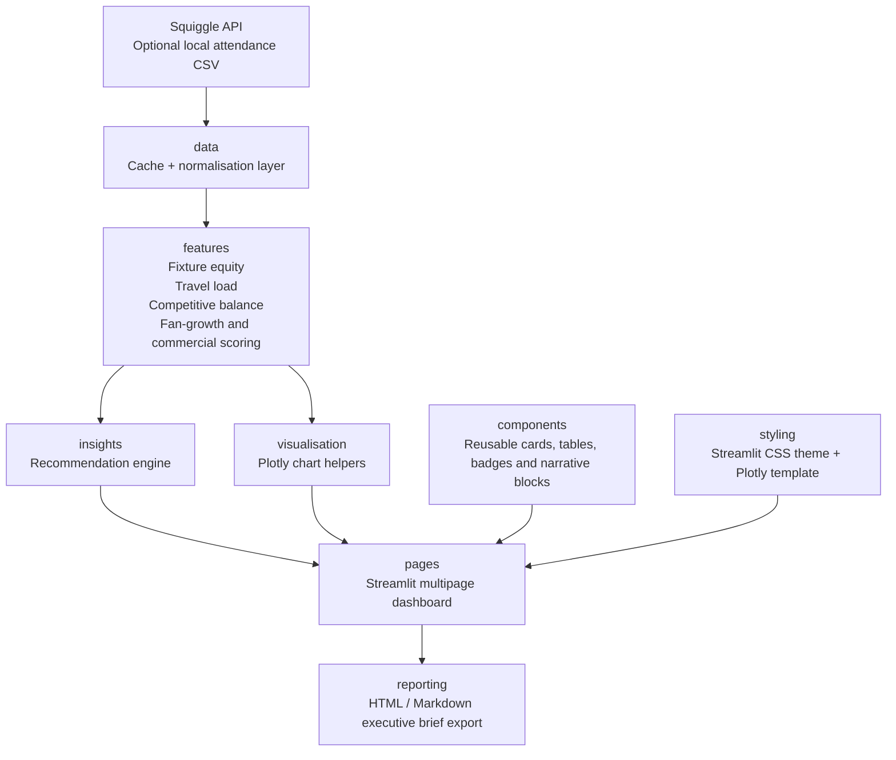

# Architecture

## Major Modules

- `data`: Squiggle client, local caching, attendance CSV support and dashboard state assembly.
- `features`: public-data fixture equity, travel load, competitive balance, fan-growth and commercial scoring.
- `insights`: cautious executive recommendation generation.
- `visualisation`: Plotly chart helpers using the shared dashboard template.
- `pages`: multipage Streamlit interface.
- `reporting`: executive brief context, HTML rendering and Markdown rendering.
- `components`: reusable UI cards, badges, layout, tables and narrative blocks.
- `styling`: Streamlit CSS theme and Plotly template.
